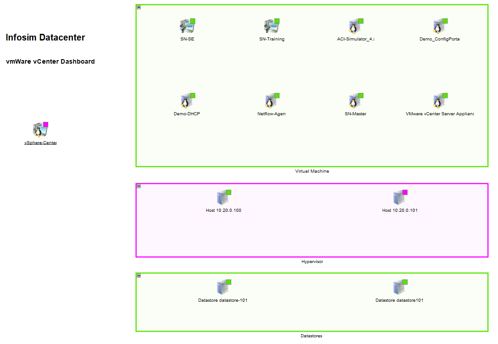
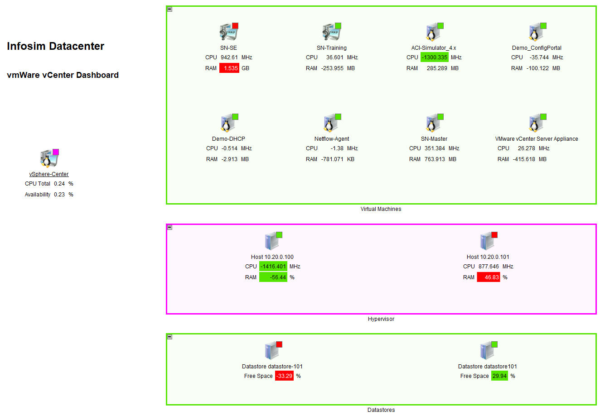

# Advanced Weather Map Handling in StableNet®

## Overview 
This repository contains several python scripts for advanced Weather Map management in StableNet® that are presented in
[this webinar](https://www.youtube.com/watch?v=Fks-zHKjROc) on YouTube.  The scripts rely on the StableNet® REST API.
They were originally written as Jupyter notebooks, but we also provide pure python files, which have been generated
automatically from the Jupyter notebooks.
  * The transfer script transfers Weather Maps from one StableNet® server to another and replaces references
to objects on the source server with the corresponding references on the target server.
  * The statistics script automatically adds statistics to nodes and links of a given Weather Map as specified in an
input CSV file.
  * The alarms script automatically adds open alarms to Weather Map nodes.

## Transfer
The only non-trivial part for transferring a Weather Map from one StableNet server to another one via REST API (and thus, 
the only reason for the existence of this script) is handling the references to objects in StableNet.  For each "relevant"
tag domain this script allows to define a non-empty and finite list of python regular expressions characterizing tag domains.
If there are two objects from the respective domain (one on each server) whose tag values are equal on all these tag categories, 
then this script assumes these objects as equal and replaces the references to the first objects with references to the 
second object.

## Statistics
This script automatically adds statistics to Weather Map nodes and links when given certain parameters as input over a CSV file. 
The format of the CSV file and the capabilities of the script are documented in
[this PDF document](StableNet_WeatherMap_Statistics/StableNet_WeatherMap_Statistics.pdf).

The following two screenshots illustrate part of the functionality that the script offers.  The first screenshot shows
the original Weather Map, whereas the second presents the Weather Map after the application of the script when given [this
CSV file](StableNet_WeatherMap_Statistics/input_node_trend.csv) as input.

## Alarms
This script is a simpler "CSV-free" version of the statistics addition script that is adding open alarms to Weather Map nodes.
